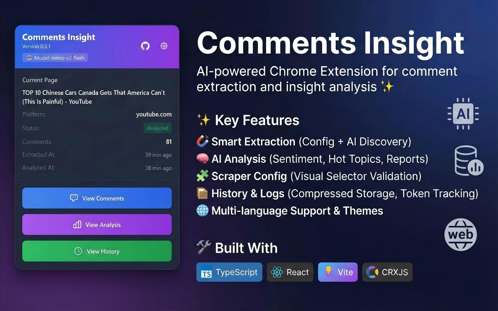
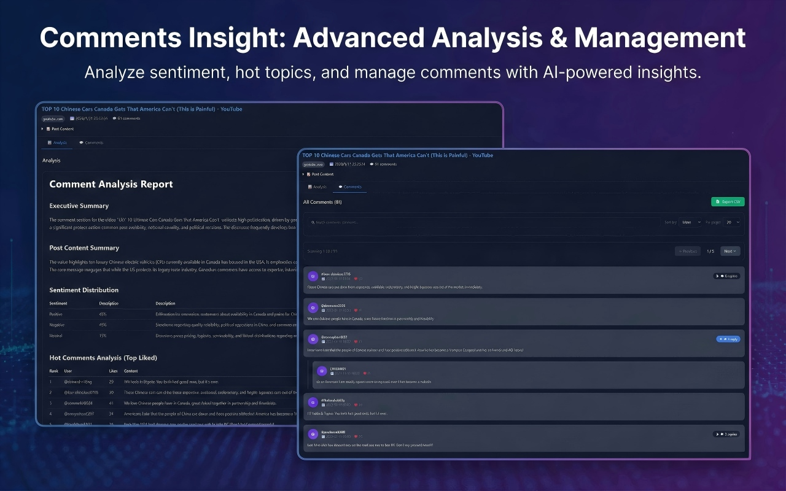
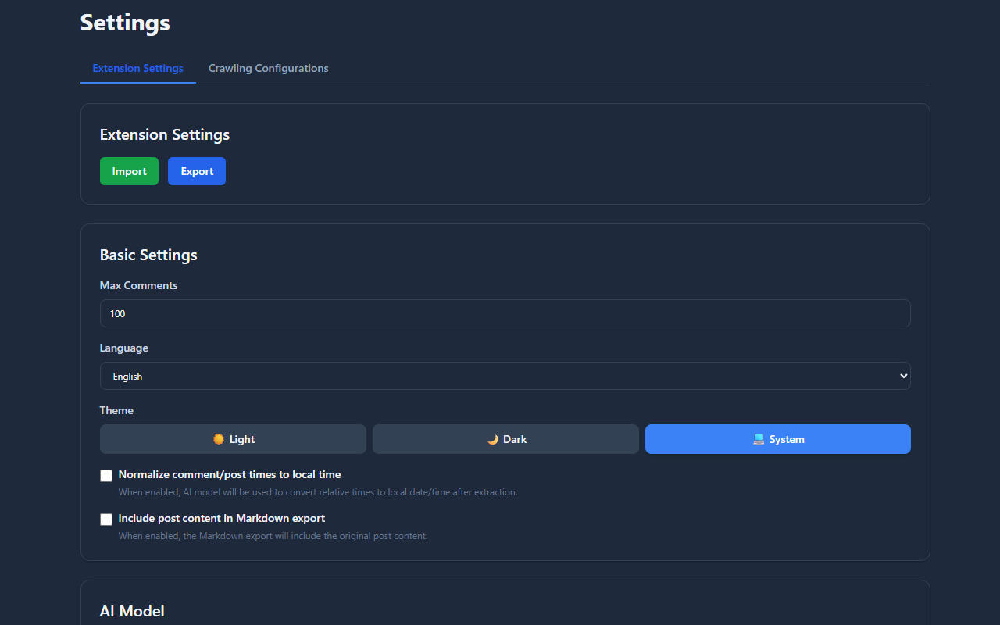
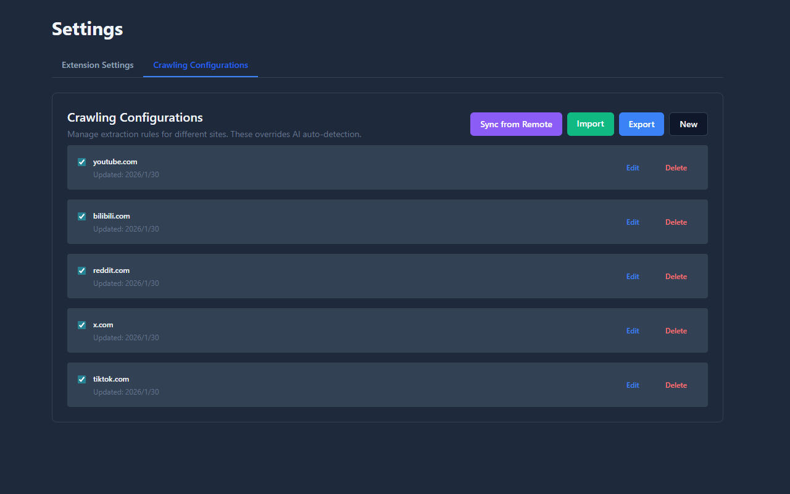
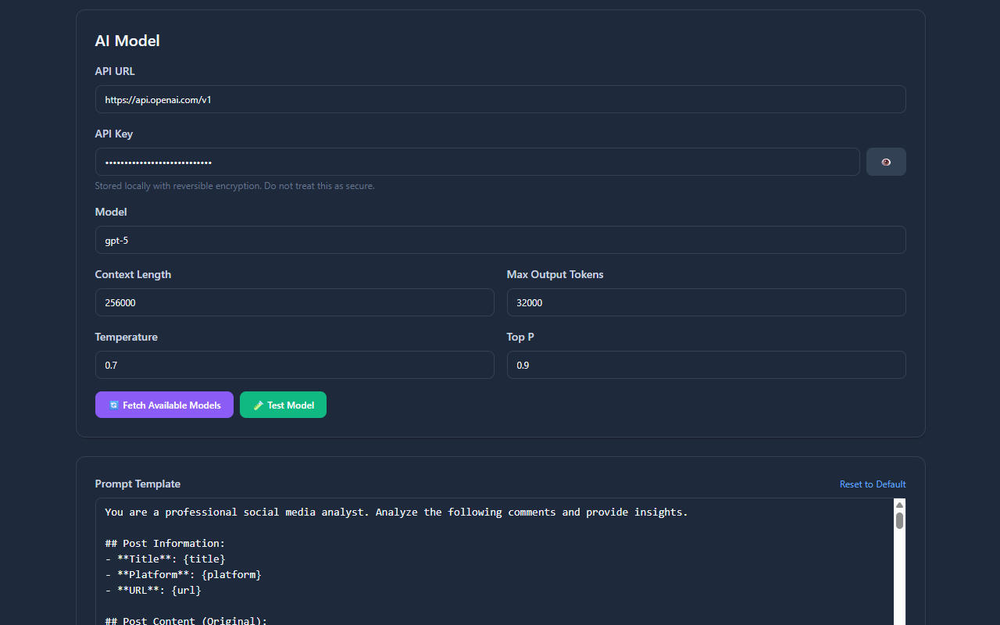

<div align="center">
  
</div>

<div align="center">

# Comments Insight

AI-powered Chrome Extension for comment extraction and insight analysis ✨

[English](README.md) | [简体中文](README.zh-CN.md)

[](https://chromewebstore.google.com/detail/comments-insight/dabladpkeglokmgppgicnbnajlipgfap) [](https://opensource.org/licenses/MIT) [](https://www.typescriptlang.org/) [](https://react.dev/) [](https://vitejs.dev/) [](https://crxjs.dev/vite-plugin/)

</div>

> Extract comments from the web, analyze them with AI, and generate actionable, structured insights.

## 📚 Table of Contents

- [Comments Insight](#comments-insight)
  - [📚 Table of Contents](#-table-of-contents)
  - [🔎 Overview](#-overview)
  - [📸 Screenshots](#-screenshots)
  - [✨ Features](#-features)
  - [🔑 API Key Security Note](#-api-key-security-note)
  - [🧱 Architecture](#-architecture)
  - [📦 Project Structure](#-project-structure)
  - [🚀 Quick Start](#-quick-start)
    - [Install from Chrome Web Store](#install-from-chrome-web-store)
    - [Build from Source](#build-from-source)
  - [🧭 Usage](#-usage)
    - [Getting Started with OpenRouter (Free Option)](#getting-started-with-openrouter-free-option)
    - [Using the Extension](#using-the-extension)
  - [⚙️ Configuration](#️-configuration)
  - [🧰 Tech Stack](#-tech-stack)
  - [🛠️ Commands](#️-commands)
  - [🤝 Contributing](#-contributing)
  - [📝 License](#-license)

## 🔎 Overview

- Manifest V3 Chrome extension with multi-page UI: Popup, Options, History, Logs.
- Built with Vite, React, TypeScript, and `@crxjs/vite-plugin`.
- Combines selectors and AI to robustly extract comments (including nested replies) and produce comprehensive Markdown reports with tables and structured data.

## 📸 Screenshots

<table>
  <tr>
    <td width="50%">
      
      <p align="center"><em>Extension Popup</em></p>
    </td>
    <td width="50%">
      
      <p align="center"><em>AI Analysis Report</em></p>
    </td>
  </tr>
</table>

<table>
  <tr>
    <td width="33.3%">
      
      <p align="center"><em>Options Settings</em></p>
    </td>
    <td width="33.3%">
      
      <p align="center"><em>Scraper Configuration</em></p>
    </td>
    <td width="33.3%">
      
      <p align="center"><em>AI Configuration</em></p>
    </td>
  </tr>
</table>

## ✨ Features

- 🧲 **Smart Extraction**:
  - Hybrid approach using Config + AI Discovery for robust selector detection.
  - Auto-scroll handling and recursive reply expansion (with visibility checks and interaction simulation).
  - Real-time progress tracking (e.g., "Extracting (55/100)").
- 🧠 **AI Analysis**:
  - **Scalable Processing**: Automatically batches large comment sets with concurrency control (up to 3 concurrent requests) to handle long threads efficiently.
  - **Thought Filtering**: Supports reasoning models (like DeepSeek) by automatically stripping `<think>` tags from output for clean reports.
  - Comprehensive reports including Sentiment Distribution, Hot Comments, Top Discussed, and Interaction Analysis.
  - Customizable prompt templates with "Reset to Default" capability.
- 🧩 **Scraper Config**:
  - Generate/edit/import/export per-site configs.
  - Visual selector validation and caching for performance.
- 🗂️ **History & Logs**:
  - **Token Tracking**: Locally records token usage stats for better cost management.
  - Compressed storage (`lz-string`) for efficient local saving.
  - Searchable history with filtering and sorting (by Time, Likes, Replies).
- 🌐 **i18n**: Multi-language support: English, Chinese (简体中文), Japanese (日本語), French (Français), and Spanish (Español).
- 🎨 **Theme Support**: Light, Dark, and System modes with automatic theme switching.
- 🛠️ **Developer Mode**: Toggle advanced features like AI Logs and Selector Testing tools.

## 🔑 API Key Security Note

API keys are stored locally (reversible encryption/obfuscation) to avoid accidental exposure, but this is **not** a strong security boundary against malware or other extensions.

## 🧱 Architecture

- **Background**: Service Worker orchestrates the Task Queue, AIService (handling concurrency, cleaning output, and token tracking), and Storage management.
- **Content Scripts**: Handles DOM traversal, interaction simulation (clicking "View Replies"), and data extraction.
- **Popup**: Main control center for triggering tasks, viewing page status, and monitoring progress.
- **Options**: Configuration for AI models (OpenAI, Ollama, etc.), Prompts, and Scraper Management.
- **History**: Rich interface for browsing extracted data and analysis reports.

## 📦 Project Structure

```
src/
  background/            # Service Worker: TaskManager, AIService, etc.
  content/               # Content Scripts: PageController, Extractor strategies
  popup/                 # Extension Popup UI
  options/               # Options Page: Settings & Config Management
  history/               # History Page: Data visualization
  logs/                  # Debug Logs Viewer
  config/                # Constants, default scrapers (5 platforms), analysis parameters
  components/            # Shared UI components (Toast, etc.)
  hooks/                 # Shared React Hooks (useTheme, useToast)
  utils/                 # Helpers: Prompts, Logger, Export, ErrorHandler, etc.
  types/                 # TypeScript definitions
  locales/               # i18n translation files (5 languages)
  styles/                # Global CSS with Tailwind
vite.config.ts          # Build config
vitest.config.ts        # Test config
```

## 🚀 Quick Start

### Install from Chrome Web Store

**[📦 Install from Chrome Web Store →](https://chromewebstore.google.com/detail/comments-insight/dabladpkeglokmgppgicnbnajlipgfap)**

Visit the Chrome Web Store to install the extension with one click.

### Build from Source

1. **Prerequisites**: Node.js 18+, Chrome.
2. **Install dependencies**:
   ```bash
   npm install
   ```
3. **Development build**:
   ```bash
   npm run dev
   ```
4. **Load into Chrome**:
   - Open `chrome://extensions`
   - Enable **Developer mode** (top right)
   - Click **Load unpacked** and select the `dist` folder
5. **Production build**:
   ```bash
   npm run build
   ```

## 🧭 Usage

### Getting Started with OpenRouter (Free Option)

OpenRouter provides access to various AI models, including free options. Here's how to set it up:

1. **Get API Key**:
   - Visit [OpenRouter](https://openrouter.ai/)
   - Sign up or log in to your account
   - Go to [Keys](https://openrouter.ai/keys) page
   - Click "Create API Key" and copy your API key

2. **Configure Extension**:
   - Click the extension icon and select "Options" (or right-click the icon → Options)
   - In the **AI Model Settings** section:
     - **API URL**: Enter `https://openrouter.ai/api/v1`
     - **API Key**: Paste your OpenRouter API key (settings are saved automatically)
     - **Model**: Select a model from the dropdown list
       - 💡 **Tip**: Models ending with `:free` are completely free to use (e.g., `z-ai/glm-4.5-air:free`, `stepfun/step-3.5-flash:free`)
       - Browse all free models at [OpenRouter Free Models Collection](https://openrouter.ai/collections/free-models)

3. **Verify Configuration**:
   - Scroll down to the **Test AI Connection** section
   - Click "Test Connection" button
   - You should see a success message confirming the API is working
   - If you see an error, double-check your API key and URL

### Using the Extension

1. **Navigate**: Go to a post or video page with comments (e.g., YouTube, Reddit, Bilibili).
2. **Extract**: Click the extension icon. If a config exists, click "Extract Comments". If not, click "Generate Config" to let AI find selectors.
3. **Monitor**: Watch the progress bar in the popup.
4. **Analyze**: Once extracted, click "Analyze Comments" to generate a report.
5. **View**: Click "View History" to see detailed comments and the analysis report.

## ⚙️ Configuration

- **AI Model**: Supports custom models. Defaults include GPT-4, Claude 3 (Opus/Sonnet/Haiku).
- **DOM Analysis**: Configure advanced parameters like `initialDepth`, `expandDepth`, and `maxDepth` for complex pages.
- **Prompts**: Customize labels/placeholders like `{comments_data}`, `{post_content}`, etc.
- **Developer Mode**: Enable in Settings to see "View AI Logs" and selector testing tools.

## 🧰 Tech Stack

- **Framework**: React 19.2, Vite 6.4
- **Language**: TypeScript 5.9 (strict mode)
- **Styling**: TailwindCSS 3.4 with dark mode support
- **Extension**: Manifest V3, CRXJS 2.2
- **i18n**: i18next 25.6 + react-i18next 16.5
- **Markdown**: react-markdown 10.1 + remark-gfm 4.0
- **Storage**: lz-string 1.5 for compression
- **Testing**: Vitest 4.0 with unit and [E2E tests](docs/e2e-testing.md) (Puppeteer 24.34)
- **Code Quality**: ESLint 9.39 + Prettier 3.6

## 🛠️ Commands

- `npm run dev`: Start dev server with HMR
- `npm run build`: Production build (TypeScript check + Vite build)
- `npm run preview`: Preview production build
- `npm run package`: Build and package for distribution (.zip)
- `npm run typecheck`: Run TypeScript checks
- `npm run lint`: Run ESLint
- `npm run lint:fix`: Run ESLint with auto-fix
- `npm run format`: Format code with Prettier
- `npm run test`: Run unit tests
- `npm run test:coverage`: Run tests with coverage report
- `npm run audit`: Check dependency security and outdated packages
- `npm run audit:fix`: Auto-fix dependency security issues

## 🤝 Contributing

Issues and PRs are welcome! Please ensure you run `npm run typecheck` and `npm run lint` before submitting.

## 📝 License

MIT License
