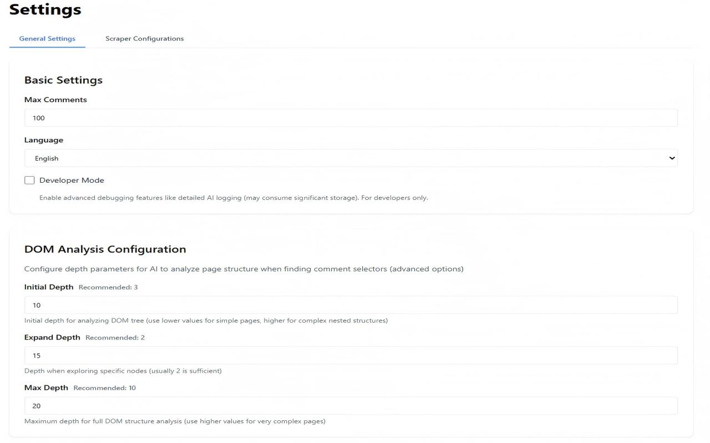
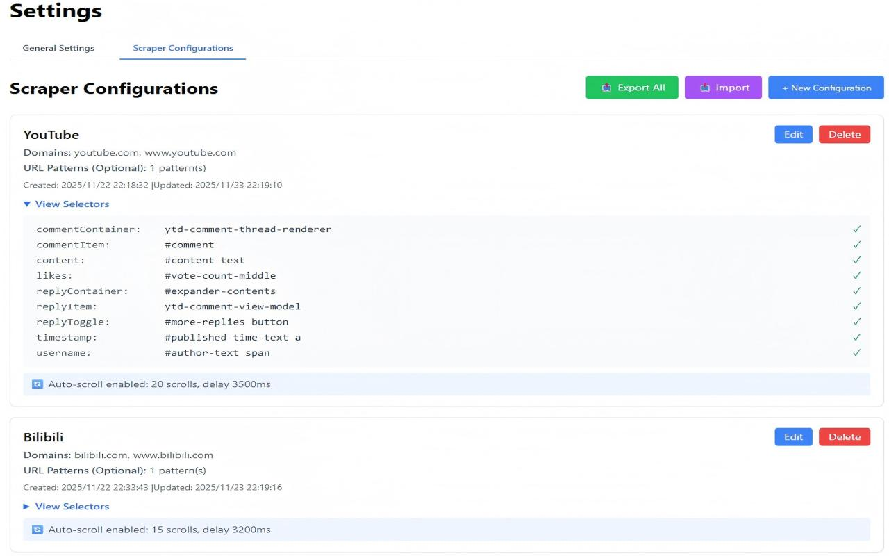

<div align="center">
  
</div>

<div align="center">

# 评论洞察 (Comments Insight)

基于 AI 的 Chrome 扩展程序，用于评论提取和洞察分析 ✨

[English](README.md) | [简体中文](README.zh-CN.md)

[](https://opensource.org/licenses/MIT) [](https://www.typescriptlang.org/) [](https://react.dev/) [](https://vitejs.dev/) [](https://crxjs.dev/vite-plugin/)

</div>

> 从网页中提取评论，使用 AI 进行分析，并生成可操作的、结构化的洞察。

## 📚 目录

- [概览](#-概览)
- [演示截图](#-演示截图)
- [核心功能](#-核心功能)
- [架构设计](#-架构设计)
- [项目结构](#-项目结构)
- [快速开始](#-快速开始)
- [使用方法](#-使用方法)
- [配置说明](#-配置说明)
- [技术栈](#-技术栈)
- [开发命令](#-开发命令)
- [常见问题 (FAQ)](#-常见问题-faq)
- [贡献指南](#-贡献指南)
- [开源协议](#-开源协议)

## 🔎 概览

- 基于 Manifest V3 的 Chrome 扩展，包含 Popup、选项页、历史记录和日志视图。
- 使用 Vite、React、TypeScript 和 `@crxjs/vite-plugin` 构建。
- 结合选择器配置与 AI 发现技术，稳健地提取评论（包括嵌套回复），并生成包含表格和结构化数据的 Markdown 洞察报告。

## 📸 演示截图

<div align="center">
  
  
</div>

<div align="center">
  
  
</div>

## ✨ 核心功能

- 🧲 **智能提取**:
  - 混合模式：使用“预设配置 + AI 自动检测”实现稳健的选择器匹配。
  - 自动滚动与递归回复展开（包含可见性检查与交互模拟）。
  - 实时进度追踪（例如：“正在提取 (55/100)”）。
- 🧠 **AI 分析**:
  - **大规模并发处理**: 自动对长评论流进行分批处理，支持多达 3 个并发请求，大幅提升分析速度。
  - **思考过程过滤**: 自动识别并移除 DeepSeek 等推理模型产生的 `<think>` 标签，确保报告内容纯净。
  - 全方位报告：包含情感分布、热门评论、核心议题和互动分析。
  - 可自定义提示词模板，支持一键恢复默认。
- 🧩 **爬虫配置**:
  - 支持按站点生成、编辑、导入/导出爬取配置。
  - 可视化选择器验证与性能缓存。
- 🗂️ **历史与日志**:
  - **Token 消耗统计**: 本地记录每次 AI 调用的 Token 消耗，帮助掌握使用成本。
  - 使用 `lz-string` 进行高效本地压缩存储。
  - 支持搜索、过滤和排序（时间、点赞数、回复数）。
- 🌐 **多语言支持**: 现已支持 English, 中文 (简体), 日本語, Français (法语), 及 Español (西班牙语)。
- 🛠️ **开发者模式**: 可开启 AI 日志详细视图和选择器测试工具。

## 🔑 API 密钥安全说明

API 密钥存储在本地（经过简单的混淆处理），旨在防止误操作导致的泄漏。这**不足以**抵御针对性的恶意软件或其他扩展程序的攻击。

## 🧱 架构设计

- **Background (后台)**: Service Worker 负责任务队列、AI 服务调用（含并发控制与数据清洗）和存储管理。
- **Content Scripts (内容脚本)**: 执行 DOM 遍历、交互模拟（点击“查看回复”）和数据提取。
- **Popup (弹窗)**: 控制中心，用于触发任务、查看页面状态和监控进度。
- **Options (选项)**: 配置 AI 模型（OpenAI、Ollama 等）、提示词和爬虫规则。
- **History (历史)**: 丰富的数据可视化界面，浏览提取的内容与分析报告。

## 📦 项目结构

```
src/
  background/            # Service Worker: 任务管理器、AI 服务等
  content/               # 内容脚本: 页面控制器、提取策略等
  popup/                 # 扩展程序弹窗 UI
  options/               # 选项页: 设置与配置管理
  history/               # 历史记录页: 数据可视化
  logs/                  # 调试日志查看器
  config/                # 常量定义、默认爬虫规则、分析参数
  components/            # 共用 UI 组件
  utils/                 # 工具类: 提示词、日志、导出、错误处理等
  types/                 # TypeScript 类型定义
vite.config.ts          # 构建配置
```

## 🚀 快速开始

1. **环境准备**: Node.js 18+, Chrome 浏览器。
2. **安装依赖**:
   ```bash
   npm install
   ```
3. **开发环境构建**:
   ```bash
   npm run dev
   ```
4. **加载到 Chrome**:
   - 打开 `chrome://extensions`
   - 启用右上角的 **开发者模式**
   - 点击 **加载已解压的扩展程序**，选择项目中的 `dist` 目录
5. **正式版本打包**:
   ```bash
   npm run build
   ```

## 🧭 使用方法

1. **配置 AI**: 在扩展选项中，输入您的 API Key 和 URL（支持标准 OpenAI 兼容接口）。
2. **访问页面**: 前往包含评论的帖子或视频页面（如 YouTube、Reddit、Bilibili）。
3. **开始提取**: 点击扩展图标。如果已有配置，点击“提取评论”；否则点击“生成配置”让 AI 协助定位。
4. **进度监控**: 在弹窗中实时查看提取进度。
5. **洞察分析**: 提取完成后，点击“分析评论”生成深度报告。
6. **查看详情**: 进入“历史记录”查看详细评论数据和 AI 分析结果。

## ⚙️ 配置说明

- **AI 模型**: 支持自定义模型。默认列表含 GPT-4, Claude 3 (Opus/Sonnet/Haiku) 等。
- **DOM 分析**: 针对复杂页面，支持配置 `initialDepth` (初始深度), `expandDepth` (展开深度) 等高级参数。
- **提示词**: 可通过 `{comments_data}`, `{post_content}` 等占位符自定义分析逻辑。
- **开发者模式**: 开启后可在弹窗中查看“AI 日志”和选择器测试工具。

## 🧰 技术栈

- **框架**: React 19, Vite 6
- **语言**: TypeScript 5.9
- **样式**: TailwindCSS
- **扩展协议**: Manifest V3, CRXJS
- **核心库**: `i18next`, `react-markdown`, `lz-string`
- **测试**: Vitest 及其 [E2E 测试](docs/e2e-testing.md)

## 🛠️ 开发命令

- `npm run dev`: 启动开发服务器
- `npm run build`: 正式打包构建
- `npm run typecheck`: 执行 TypeScript 类型检查
- `npm run lint`: 执行代码检查
- `npm run format`: 使用 Prettier 格式化代码
- `npm run test`: 运行单元测试
- `npm run test:coverage`: 运行测试并生成覆盖率报告

## 🤝 贡献指南

欢迎提交 Issue 和 PR！在提交之前，请确保通过了 `npm run typecheck` 和 `npm run lint`。

## 📝 开源协议

MIT License
